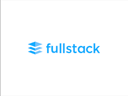
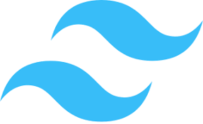

<!--
**raminfosystems/raminfosystems** is a ✨ _special_ ✨ repository because its `README.md` (this file) appears on your GitHub profile.

Here are some ideas to get you started:

- 🔭 I’m currently working on ...
- 🌱 I’m currently learning ...
- 👯 I’m looking to collaborate on ...
- 🤔 I’m looking for help with ...
- 💬 Ask me about ...
- 📫 How to reach me: ...
- 😄 Pronouns: ...
- ⚡ Fun fact: ...
-->

# Ram Infosystems Limited

Welcome to the official GitHub repository of Ram Infosystems Limited. We are a leading software development company
providing top-notch IT solutions and services.

## About Us

Ram Infosystems Limited is a pioneer in the IT industry, offering a comprehensive suite of services including software
development, IT consulting, digital transformation, and more. We are committed to delivering innovative and efficient
solutions that drive the growth of businesses worldwide.

## Our Services

1. **Software Development**: We build robust and scalable software solutions tailored to your business needs.
2. **IT Consulting**: Our experts provide strategic guidance on technology, IT infrastructures, and the adoption of
   next-generation technologies.
3. **Digital Transformation**: We help businesses digitize their operations, products, and services to meet the changing
   demands of customers.

## Why Choose Us

- Expert team of professionals
- Proven track record of success
- Innovative and customized solutions
- Excellent customer service

## Some facts about us

 

## Our Tech Stack 

<table>
  <tr>
    <td align="center">
        
         Angular
    </td>
    <td align="center">
        
         Apollo
    </td>
<td align="center">
        
         ASP.NET Core
    </td>
<td align="center">
        
         AWS
    </td>
<td align="center">
        
         Azure
    </td>
<td align="center">
        
         Bash
    </td>
<td align="center">
        
         Bootstrap 5
    </td>
<td align="center">
        
         Buefy
    </td>
<td align="center">
        
         C# CSharp
    </td>
  </tr>
  <tr>
    <td align="center">
        
         Dart
    </td>
    <td align="center">
        
         Docker
    </td>
<td align="center">
        
         Firebase
    </td>
<td align="center">
        
         Flutter
    </td>
<td align="center">
        
         Fullstack
    </td>
<td align="center">
        
         Git
    </td>
<td align="center">
        
         GraphQL
    </td>
<td align="center">
        
         Ionic
    </td>
<td align="center">
        
         Javascript
    </td>
  </tr>
  <tr>
    <td align="center">
        
         Laravel
    </td>
    <td align="center">
        
         Material UI
    </td>
<td align="center">
        
         Microsoft Partner
    </td>
<td align="center">
        
         ML.NET
    </td>
<td align="center">
        
         MongoDB
    </td>
<td align="center">
        
         MySQL
    </td>
<td align="center">
        
         NestJs
    </td>
<td align="center">
        
         NgInx
    </td>
<td align="center">
        
         NodeJs
    </td>
  </tr>
  <tr>
    <td align="center">
        
         Php
    </td>
    <td align="center">
        
         React
    </td>
<td align="center">
        
         Redux
    </td>
<td align="center">
        
         SQl Server
    </td>
<td align="center">
        
         Tailwind CSS
    </td>
<td align="center">
        
         Typescript
    </td>
<td align="center">
        
         Vendure
    </td>
<td align="center">
        
         Vue.js
    </td>
<td align="center">
        
         WordPress
    </td>
  </tr>
</table>

## Contact Us

For any inquiries, please contact us at:

[Write to Us](mailto:info@raminfosystems.co.uk?Subject=Hello)

[Send a WhatsApp Message](https://wa.me/?text=Hello%20Ram%20Infosystems%2C%0A%0AI%20would%20like%20to%20know%20more%20about%20your%20services.%20Please%20contact%20me.%0A%0AThanks.)

## Follow Us

Stay connected with us:

- [Facebook](#)
- [Twitter](#)
- [LinkedIn](#)

## License

This project is licensed under the terms of the MIT license.

## Disclaimer

The information contained in this repository is for general information purposes only. We make no representations or
warranties of any kind, express or implied, about the completeness, accuracy, reliability, suitability, or availability
with respect to the information contained on this repository for any purpose. Any reliance you place on such information
is therefore strictly at your own risk.